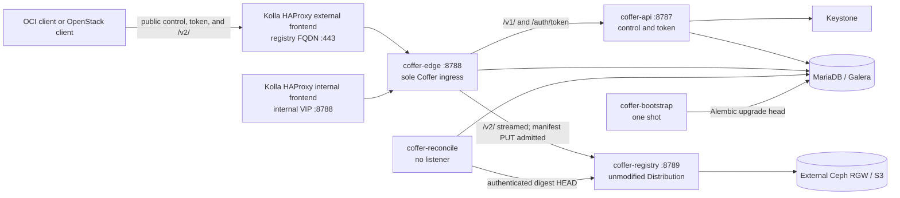
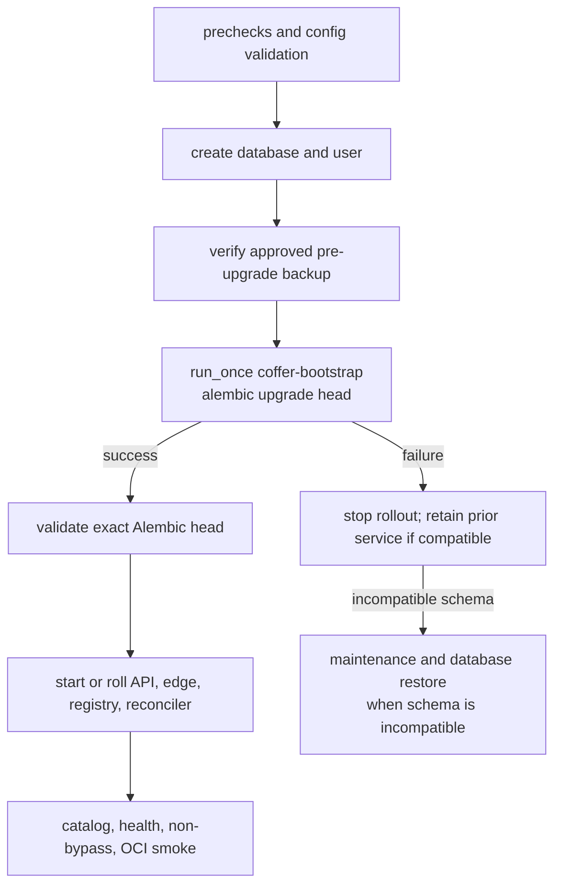

# Kolla Deployment Topology

- Status: accepted Stage 1 contract; Stages 2 through 4 verified; production
  image qualification remains blocked on the signed Distribution release
- Updated: 2026-07-24
- Decision: `docs/adrs/0014-fix-kolla-deployment-topology.md`
- Execution plans: `docs/exec-plans/0013-kolla-deployment-topology.md`,
  `docs/exec-plans/0014-kolla-runtime-images.md`,
  `docs/exec-plans/0015-kolla-ansible-operator-role.md`,
  `docs/exec-plans/0016-kolla-aio-end-to-end.md`,
  `docs/exec-plans/0017-production-image-remediation.md`

This document is the operator-facing topology baseline for packaging Coffer
with Kolla and deploying it through an operator-local Kolla-Ansible role. It
fixes boundaries and ordering. Stage 2 fixes and locally verifies the
runtime/image contents. Stage 3 implements and exercises the operator-local
role. Stage 4 proves the complete disposable AIO tenant path. Plan 0017
provides the reproducible image qualification baseline without claiming
production promotion.

## Request Topology

No external or tenant route reaches `coffer-api` or `coffer-registry`
directly. HAProxy terminates the client TLS connection and selects the Coffer
FQDN. `coffer-edge` owns Coffer-local path dispatch and the non-bypassable
manifest-admission seam.

## Runtime Contract

| Service | Default backend port | Publicly reachable | Required dependencies |
|---|---:|---|---|
| `coffer-api` | 8787 | No | Keystone, SQL, signing key |
| `coffer-edge` | 8788 | Through HAProxy only | API, Distribution, SQL, public JWKS |
| `coffer-registry` | 8789 | No | RGW, public JWKS, shared HTTP secret |
| `coffer-reconcile` | None | No | SQL, authenticated Distribution route |
| `coffer-bootstrap` | None | No; one-shot | SQL |

These defaults had no exact collision in the inspected Kolla-Ansible
`stable/2026.1` port declarations. The companion role rejects an inventory
whose resolved host bindings collide.

Edge-to-API and edge/reconciler-to-Distribution requests use private internal
HAProxy service frontends on ports `8787` and `8789`, which load-balance the
corresponding container backends. Services never embed an ad hoc replica list.
An AIO can collapse the hop while keeping the same origin and fail-closed
network contract.

One Coffer runtime artifact supplies `coffer-api`, `coffer-edge`,
`coffer-reconcile`, and `coffer-bootstrap`; Kolla selects exactly one command
per container. Distribution remains a separate artifact using the unmodified
official release binary. Both final templates end as dedicated non-root users
and preserve the table's process and secret boundaries.

## Endpoint Contract

| Surface | Endpoint | Route |
|---|---|---|
| Canonical OCI origin | `https://<coffer_external_fqdn>/` | External HAProxy to edge |
| Keystone public catalog | `https://<coffer_external_fqdn>/v1` | Edge to API |
| Keystone internal catalog | `https://<coffer_internal_fqdn>:8788/v1` | Internal HAProxy to edge to API |
| Keystone admin catalog | Same as internal | No separate admin listener |
| Token realm | `https://<coffer_external_fqdn>/auth/token` | Edge to API |

The production profile uses Kolla's single external frontend so the registry
FQDN uses port 443. A disposable AIO may use an explicit high port, but it must
not be described as the production endpoint.

Public edge routing is closed by default:

- `/v2/` and descendants stream to Distribution, with manifest/index PUT
  admitted by the quota seam.
- `/auth/token` and `/v1/` route to `coffer-api`.
- health, readiness, and metrics stay on operator-only backend access.
- every other path is rejected.

The proposed Keystone service type is `oci-registry`; it remains a project
proposal rather than a registered OpenStack service-types authority value.

## TLS and Network Contract

| Hop | Production requirement |
|---|---|
| Client to external HAProxy | Trusted TLS on the canonical registry FQDN |
| Internal client to internal HAProxy | Trusted internal VIP TLS |
| HAProxy to edge | Verified backend TLS |
| Edge to API | Verified backend TLS; Basic/Keystone authorization headers never logged |
| Edge or reconciler to Distribution | Verified backend TLS |
| API to Keystone/Barbican | Verified dependency TLS |
| Distribution to RGW | Verified RGW TLS |

A disposable network-isolated AIO may temporarily use HTTP between private
backends. The role must keep those ports unreachable from tenant/external
networks and label the profile non-production. Production promotion requires
all rows in the table.

The product edge now supports separate verified HTTPS API and Distribution
origins with CA and hostname validation, bounded timeouts, health probes,
closed routing, bounded streaming, and deterministic aggregate-only 503
transport failure. Plaintext is allowed only by an explicit fixture switch
and literal loopback origin. Stage 3 wires these contracts through Kolla
HAProxy without weakening them; the local and isolated Linux contracts verify
edge-only external routing and required backend TLS.

## Secret Ownership

Secret material is materialized by an owner-controlled deployment step into
root-owned mode-`0600` host files and copied or mounted read-only through
Kolla's configuration-file contract. The preferred secret authority is
Barbican. Runtime services do not fetch secrets from Barbican per request, and
the deployment controller's own Barbican authentication is not passed into the
runtime containers.

| Material | API | Edge | Registry | Reconciler | Bootstrap |
|---|:---:|:---:|:---:|:---:|:---:|
| JWT signing private key | Yes | No | No | No | No |
| Public JWKS | No | Yes | Yes | No | No |
| Distribution HTTP secret | No | No | Yes | No | No |
| RGW credential | No | No | Yes | No | No |
| SQL credential | Yes | Yes | No | Yes | Yes |
| Keystone service credential | Yes | No | No | No | No |
| Reconciliation Distribution read credential | No | No | No | Unresolved production gate | No |
| Production live-comparison credential | No | No | No | No | No |

CA bundles are public trust material and go only to the clients that require
them. TLS private keys go only to the connection terminator. No secret value is
stored in Git, inventory, an execution plan, a handoff, a command line, or a
log. ADR 0013's unresolved live-comparison credential belongs only to an
owner-controlled maintenance job; it is not mounted into any runtime service.

## Deploy, Upgrade, and Rollback Order

Application processes never create or upgrade tables. Repeating bootstrap at
the current head must be safe. Production rollback never blindly invokes
Alembic downgrade: operators restore the previous image/configuration when the
schema is compatible, or restore the approved database backup under maintenance
when it is not. Existing-data import, writer exclusion, object backup/restore,
Distribution upgrade, and GC each require their own runbook and authorization.

## Lab Placement

`bb00` remains a shared KVM host only. No Coffer or Kolla package is installed
on it directly. Stage 2 used only the disposable local Mac/Podman contract
harness and did not access the host. Stage 3 used a separately named,
autostart-disabled VM with dedicated address and storage, ran the bounded
Linux role lifecycle, then removed the domain, its volumes, and temporary
state. Existing Harbor, host HAProxy, `coffer-rgw-poc`, `dev11-*`, and
unrelated domains were not mutated or implicitly reused.

Kolla's bootstrap registry is independent of the tenant Coffer registry. The
existing Harbor deployment is only a future candidate for that external input.
Coffer cannot pull the images required to start itself.

## Long-Horizon Stage Gates

| Stage | Scope | Exit evidence |
|---:|---|---|
| 1 | Topology and operating contract | Accepted ADR 0014, this contract, read-only target inventory |
| 2 | Runtime entry points and Kolla-compatible images | API, edge, reconciliation, bootstrap, and Distribution artifacts pass startup, TLS, permission, health, logging, and image checks |
| 3 | Operator-local Kolla-Ansible role | Deploy/reconfigure/pull/upgrade/stop, Keystone registration, DB bootstrap, HAProxy, config, logging, and prechecks pass |
| 4 | Kolla AIO end-to-end | Two-project OCI isolation, restart persistence, repeat migration, idempotent reconfigure, edge non-bypass, and residue checks pass |
| 5 | Multinode and HA pilot | Replica loss, rolling upgrade, Galera, key overlap, load balancing, fencing, and rollback rehearsals pass |
| 6 | Production promotion | Distribution/Ceph/KMS, identity, backup/cutover, observability, load, and GC gates close |
| 7 | Upstream path | Kolla and Kolla-Ansible changes have integrated CI and an agreed governance destination |

Stages 1 through 4 are complete. Plan 0017 additionally proves that the final
templates build reproducibly on the digest-pinned Ubuntu Noble ARM64 platform
through exact Kolla 2026.1 sources. The candidate artifacts pass the full local
runtime contract; the Coffer image reports zero Critical/High under Docker
Scout and Trivy. Production remains closed because the signed Distribution
v3.1.1 release binary retains 8 Critical/10 High under Scout, 22 High under
Trivy, three source-reachable vulnerabilities, and 37 vulnerable binary symbol
groups. This image evidence does not replace Stage 5 HA or the other Stage 6
promotion gates.

Every later stage starts with a fresh execution plan and one exact next action.
Completing one stage does not authorize deployment, credentials, destructive
testing, publication, or the next stage.
