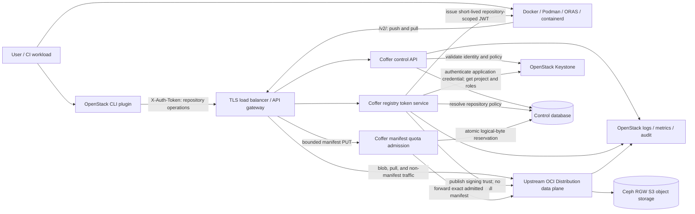
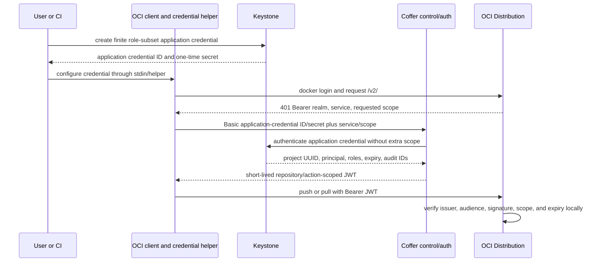

# Coffer MVP Architecture Baseline

- Status: accepted PoC baseline; production promotion gates remain
- Updated: 2026-07-22
- Architecture style: OpenStack-native control plane composed with an upstream OCI Distribution data plane

## Architecture Drivers

1. Unmodified Docker, Podman, containerd, and ORAS clients must use the standard OCI Distribution workflow.
2. Keystone projects and roles are the authorization source of truth.
3. Registry traffic must not turn Keystone into the per-layer data-path bottleneck.
4. Content must remain portable OCI data in operator-controlled object storage.
5. The first release targets a highly available single OpenStack region, not global active-active operation.
6. Coffer should own only OpenStack-specific control, authorization, policy, and operations behavior that upstream registries do not provide.

## Context and Component Boundaries

### Coffer control API

Owns project-scoped repository resources, repository policy, tag immutability configuration, bounded soft-quota state, administrative GC requests, and audit metadata. It does not proxy blob bodies or duplicate canonical manifests into its database.

### Coffer registry token service

Implements the OCI/Docker Bearer token challenge endpoint. For the MVP it authenticates a finite, role-restricted Keystone application credential supplied through Basic auth, verifies its immutable project scope and roles, and issues a separate approximately five-minute JWT containing only the intersection of requested and authorized `repository:<namespace>/<name>:<actions>` access. It never stores the application-credential secret, never issues a non-expiring refresh token, and Distribution verifies the JWT signature locally.

### Coffer manifest quota admission

Handles only bounded manifest/index PUT requests at a non-bypassable private edge. It verifies the Coffer JWT and explicit repository authority, resolves the descriptor graph, atomically reserves project-unique logical bytes in shared SQL, forwards the exact manifest bytes to unmodified Distribution, and commits or conservatively retains the reservation from the upstream outcome. It returns Distribution-compatible 429 or 503 responses and never stores blob bodies or the canonical manifest payload.

### Upstream OCI Distribution data plane

Owns `/v2/` blob, upload, canonical manifest, tag, supported artifact, and deletion protocol behavior. Coffer configures its token trust, storage driver, health, and metrics; manifest publication passes the narrow quota edge, but the protocol implementation remains unmodified. Native OCI 1.1 Referrers support must be proven for the pinned release.

### Control database

Stores resource identity, stable project mapping, repository policy, signing-key metadata, logical quota reservations/usage observations, operation records, and audit references. It does not become a permanent registry credential store. Blob content and the canonical manifest payload remain in object storage.

### Object storage

Uses one service-owned, non-public regional S3-compatible bucket with a dedicated least-privilege identity. The MVP backend is Ceph RGW through the upstream S3 driver, with redirects disabled initially and server-side KMS encryption verified against the selected stable Ceph release. The Tentacle 20.2.2 PoC passed positive-size Barbican SSE-KMS payloads only after forcing Distribution moves through multipart copy; encrypted zero-byte moves remain a production release gate. Distribution v3 does not provide a Swift driver baseline, so a custom Swift adapter is not part of the MVP.

## Resource Model

| Resource | Proposed identity and scope | Notes |
|---|---|---|
| Regional registry service | One service-catalog endpoint per OpenStack region | Multiple HA replicas share control and object storage |
| Project namespace | Canonical immutable Keystone project ID | Human-readable project names may be aliases, never the security boundary |
| Repository | Explicit control-plane resource under one project | Push is denied unless the repository exists and policy permits creation-on-push |
| Manifest/artifact | OCI digest under a repository | OCI index, artifact manifest, and referrers remain portable |
| Tag | Mutable alias by default or immutable by repository policy | Digest pulls remain authoritative |
| Keystone application credential | User-owned, finite, role-restricted, project-bound | Used through a credential helper/Basic auth only to request short-lived registry JWTs; never stored by Coffer |

The canonical data-plane name for the PoC is `p/<project-id>/<repository>`. A later API can add stable aliases without weakening the project-ID authorization boundary.

## Authentication and Authorization Flow

### Authorization baseline

- Keystone project membership is necessary but not sufficient; `oslo.policy`-style rules map roles to registry actions.
- Initial project roles are `reader` for pull, `member` for pull/push, and `admin` for pull/push/delete plus project-level registry policy. Scope and role are always evaluated together.
- The requested OCI token scope is intersected with control-plane authorization; the service never reflects an unverified client scope.
- Distribution receives no Keystone credentials and does not call Keystone on blob requests.
- The standalone `service` role is reserved for internal service-to-service operations. Domain/system roles do not automatically grant tenant repository access.
- Tenant automation uses dedicated users with finite, restricted application credentials and an OS credential helper; human passwords are never a registry login mechanism.
- Cross-project blob mounts are denied in the PoC. Later support requires independent source-pull and target-push authorization.

## Data and Consistency Model

- Object-store digests are the canonical content identity.
- The control database is authoritative for repository existence and policy, not blob presence.
- Registry push/delete notifications can update usage and audit projections asynchronously; their per-instance queues are in-memory and unordered, so consumers must be idempotent and a reconciliation crawler must repair missing projection state. Notifications are never sufficient for authorization.
- Coffer charges logical unique digests per project even when physical blobs deduplicate globally. Reservation/admission plus authoritative reconciliation provides a measured bounded soft quota; byte-perfect physical enforcement is not an MVP claim.
- Manifest deletion unlinks content; physical blob reclamation uses the upstream mark-and-sweep collector only during a coordinated read-only or stopped-registry window, beginning with dry run.

## HA and Operations Baseline

- At least two stateless control/auth replicas and two Distribution replicas with identical backend configuration and HTTP secret behind the regional TLS load balancer; use shared Redis when configured.
- Shared HA SQL and object storage are external dependencies with independent backup and recovery procedures.
- Signing keys are versioned with overlapping public trust during rotation; private keys and S3/Redis/HTTP secrets belong in a Barbican/Vault/HSM-backed secret path, not ordinary configuration files.
- Health endpoints distinguish process readiness from Keystone, SQL, and object-storage dependency health.
- Structured audit events include actor, project, repository, action, result, request ID, and digest where available; they exclude tokens and secrets.
- Metrics cover request rate/latency/error, auth decisions, upload/pull bytes, storage and quota reconciliation drift, GC, and dependency failures.

## Security Baseline

| Threat | MVP mitigation |
|---|---|
| Cross-project repository access | Immutable project-ID namespace, policy intersection at token issuance, negative isolation tests |
| Forged or over-scoped registry JWT | Asymmetric signing, fixed issuer/audience, short expiry, explicit action scope, key rotation |
| Stolen Docker credentials | Finite role-subset application credential, credential helper/stdin, rotation and revocation; approximately five-minute registry JWTs; no human password storage |
| Direct object-store bypass | Private RGW endpoint, redirects disabled initially, and a service-only least-privilege bucket identity |
| Tag replacement or rollback | Optional tag immutability, digest-pinned deployment guidance, audited mutations |
| Malicious manifests or oversized uploads | Protocol limits, rate limits, request timeouts, content-length and storage safeguards |
| Unsafe deletion/GC | Project-admin logical delete; global all-replica read-only mode; Distribution dry-run/GC; backup and shared-layer survival checks |
| Secret leakage in logs or handoffs | Central redaction policy; never log Authorization headers, tokens, credentials, or signing material |
| Dependency or image vulnerability | Preserve OCI referrers and event hooks; integrate scanners and policy engines after MVP |

## Proposed Technology Baseline

| Area | Proposed choice | Rationale |
|---|---|---|
| OCI data plane | Upstream CNCF Distribution v3.1.1 or newer supported release, pinned by PoC | Small protocol-focused component; v3.1.1 includes a material 2026 security fix and must still pass conformance/RGW gates |
| Control/auth services | Python with OpenStack `oslo.*`, `keystoneauth1`, and `keystonemiddleware` libraries | Fits OpenStack operator and contributor ecosystems |
| HTTP framework | Falcon 4.3.1 WSGI behind Gunicorn `gthread` workers | Accepted by ADR 0007 after Python 3.11–3.13 and process-model validation |
| Persistence | SQLAlchemy/Alembic through `oslo.db`; MariaDB/Galera as the operator baseline | Aligns with common OpenStack control-plane deployments |
| Policy | `oslo.policy`-compatible rules | Familiar deployer overrides and role enforcement |
| Blob storage | One private regional Ceph RGW S3 bucket through the upstream registry driver | Reuses common OpenStack storage deployments without a custom driver; per-project buckets would require separate registry fleets/routing |
| Edge | Operator-provided TLS load balancer/reverse proxy | Keeps network topology and certificate ownership deployer-controlled |
| Observability | Structured OpenStack-style logging, request IDs, Prometheus-compatible metrics | Supports both OpenStack operations and registry-specific dashboards |

## Deferred Architecture

- Scanner, signer, admission-policy, notification, lifecycle, cache, and replication workers.
- Global routing and multi-region consistency.
- Search/index service and user interface.
- Per-project physical object-store isolation or sharded registries.
- A Swift-native storage driver; upstream marks it unsupported and is not accepting new drivers.
- Integration packaging for Kolla-Ansible, OpenStack-Helm, or other deployment systems.
- Glance import/export bridging and native consumer helpers for Ironic, Kolla, Zun, or Magnum.

## Risks Requiring PoC Evidence

1. Standard Docker credential storage requires a credential helper and finite application credentials; future federated/MFA users need a separate helper/exchange design.
2. Distribution's stop-the-world GC requires a maintenance window; always-online GC is not an MVP claim.
3. Project quota admission now has a validated manifest seam, but production still needs shared-database migrations, reconciliation, replica-level failure tests, and a non-bypassable ingress deployment.
4. Repository aliases and rename semantics can conflict with immutable security namespaces.
5. The chosen Distribution and Ceph combination must pass encrypted move semantics, including positive-size and zero-byte blobs. Tentacle 20.2.2 requires forced multipart copy for positive-size objects and still rejects the zero-byte path.
6. OpenStack community governance may favor an adjacent-project or external-service path before a new official service.
7. Current Distribution documentation targets OCI Distribution Spec 1.0.1; native OCI 1.1 Referrers support is an unresolved release gate.
8. RGW quotas are cached per gateway and a shared bucket cannot provide project-level accounting; project logical admission therefore does not bound unpublished physical staging.
9. Barbican SSE-KMS, wrong-key/outage fail-closed behavior, restart persistence, logging, and bounded cleanup passed against Tentacle 20.2.2. Production promotion still requires a released Ceph fix/backport or another proven combination for encrypted zero-byte moves, plus operational key rotation.

## Evidence Baseline

- [CNCF Distribution token authentication](https://distribution.github.io/distribution/spec/auth/token/) defines the external authorization-service challenge, requested/granted scope intersection, and signed Bearer-token flow used by this design.
- [CNCF Distribution notifications](https://distribution.github.io/distribution/about/notifications/) documents per-instance in-memory queues and non-guaranteed ordering, requiring idempotent projections and reconciliation.
- [CNCF Distribution garbage collection](https://distribution.github.io/distribution/about/garbage-collection/) documents mark-and-sweep collection and the read-only/stopped-registry safety requirement.
- [CNCF Distribution storage drivers](https://distribution.github.io/distribution/storage-drivers/) provides the upstream S3 integration surface used for the Ceph RGW PoC.
- [Distribution v3.1.1 release](https://github.com/distribution/distribution/releases/tag/v3.1.1) is the initial security baseline; the PoC must pin the then-supported exact release and image digest.
- [Keystone application credentials](https://docs.openstack.org/keystone/latest/user/application_credentials.html) documents project binding, role subsets, expiration, one-time secret disclosure, hashing, invalidation, and rotation behavior.
- [Keystone service guidance](https://docs.openstack.org/keystone/latest/contributor/services.html) defines project/domain/system scope and identity semantics used by the role model.
- [Ceph RGW](https://docs.ceph.com/en/latest/radosgw/), [Keystone integration](https://docs.ceph.com/en/latest/radosgw/keystone/), and [encryption](https://docs.ceph.com/en/latest/radosgw/encryption/) define the storage capabilities whose exact stable-release behavior must be tested.
- [Distribution S3 driver parameters](https://distribution.github.io/distribution/storage-drivers/s3/#parameters) document the multipart-copy threshold used by the Tentacle positive-size workaround; `docs/research/m3-rgw-kms-capability.md` records the exact release boundary and source evidence.
- `docs/adrs/0001-compose-cnc-distribution.md` records the upstream component comparison and rejected alternatives.
- `docs/adrs/0002-keystone-application-credential-token-broker.md` records the identity translation and initial role model.
- `docs/adrs/0003-rgw-s3-single-region-storage.md` records storage, quota, GC, encryption, and HA boundaries.
- `docs/adrs/0009-add-private-edge-manifest-quota-admission.md` records the accepted-for-PoC manifest admission seam and the remaining production gates.
- `docs/research/openstack-registry-landscape.md` records the current OpenStack service gap, active OpenStack-Helm deployment chart, consumer projects, and historical false friends.
