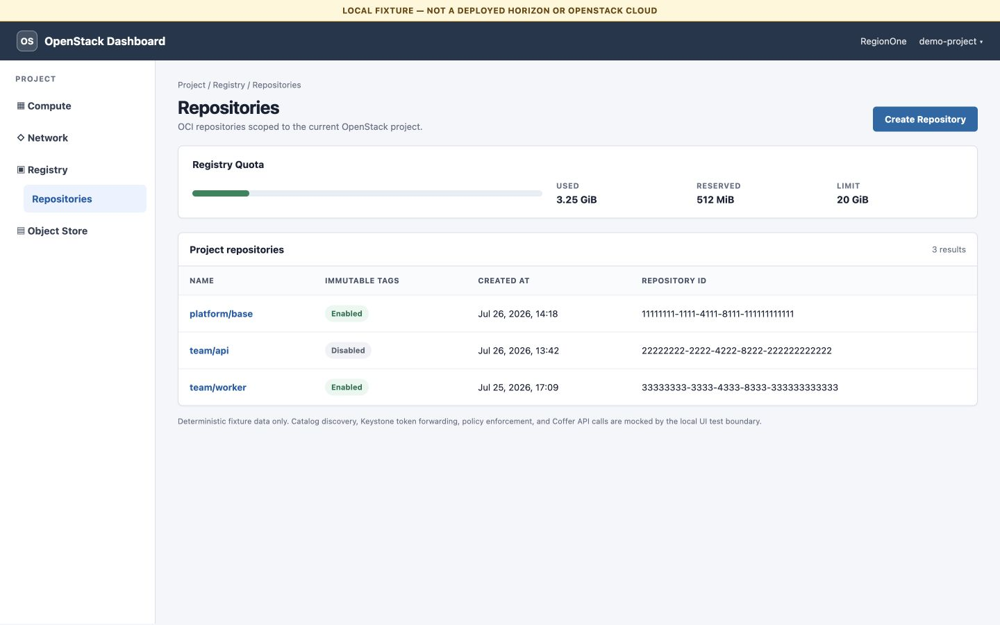
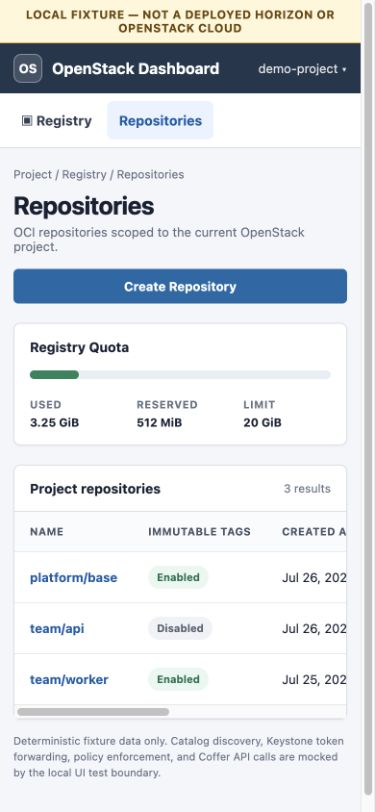
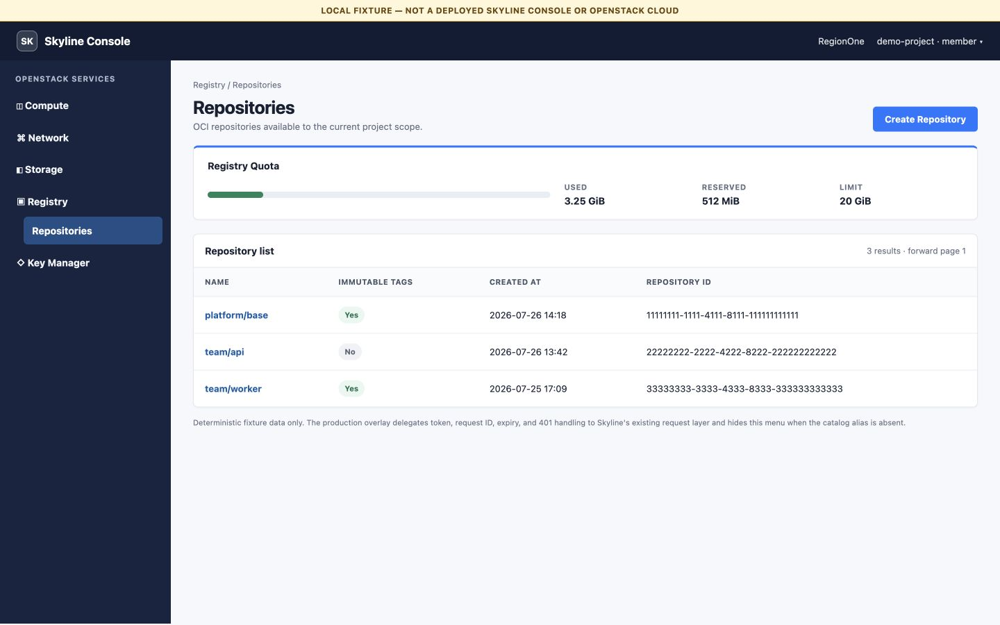
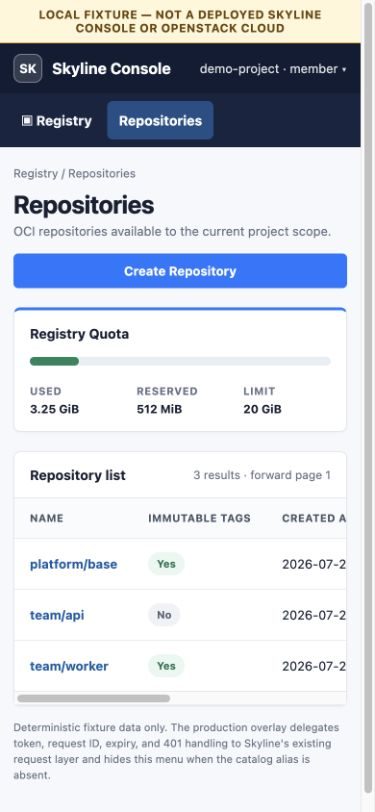

# UI rendered fixtures

These static pages make the accepted Horizon and Skyline Coffer surfaces
visually inspectable without a cloud:

- `horizon.html`
- `skyline.html`

They use the same deterministic repository and quota data. A persistent banner
states that they are local fixtures. They contain no token, endpoint,
credential, remote script, external asset, or live API behavior.

The fixture proves layout, hierarchy, responsive behavior, table overflow,
quota presentation, and the intentionally bounded action surface. It does not
prove framework rendering, catalog discovery, Keystone authorization, API
isolation, Kolla deployment, or a browser session in a real cloud. Those
behavioral contracts are covered by the source tests; live deployment remains
gated by plan 0019.

## Visually inspected evidence

Desktop content viewport: 1440 × 900. Narrow capture viewport: 375 × 812
after browser chrome. At the narrow breakpoint the document remains within
the viewport while the repository table owns its bounded horizontal scroll.

### Horizon

### Skyline Console

