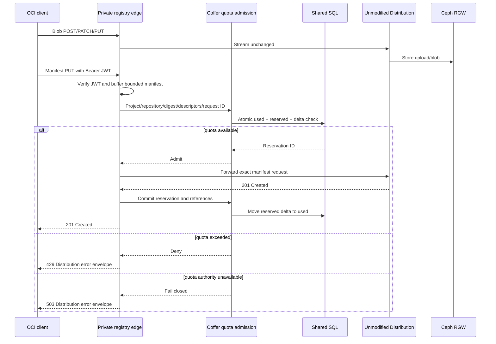

# M3 Bounded Soft-Quota Enforcement Spike

- Date: 2026-07-22
- Status: design spike complete; implementation requires ADR acceptance
- Scope: project logical quota with unmodified OCI clients, Distribution, and a shared RGW bucket

## Result

The current token broker, Distribution notifications, and RGW bucket quota cannot by themselves provide a measurable project-level overshoot bound:

- a standard registry push-token request carries repository actions but no expected byte count or one-use upload identity;
- one five-minute `push` JWT can authorize multiple blob and manifest operations;
- Distribution notifications are asynchronous, in-memory per instance, and unsuitable for admission;
- the one shared RGW bucket can enforce only a service-wide physical guardrail, not per-project logical usage.

The smallest enforceable seam is therefore a narrow **manifest admission path at the private registry edge**. Blob uploads remain streaming Distribution traffic. Before a manifest becomes visible, the edge buffers only the bounded manifest payload, asks Coffer to reserve its new project-logical descriptor bytes in a shared SQL transaction, then forwards the unchanged request to unmodified Distribution. This is a proposed architecture change, not an implemented or accepted decision.

Token-time reservation alone is rejected. Without inspecting a manifest or upload byte count, no reservation unit can be both safe and usable: a fixed maximum is excessively conservative, while a smaller unit can be exceeded repeatedly with the same token.

## Accounting Definition

Project logical usage is the total size of unique OCI descriptors reachable from live manifests in that project:

- each digest is charged once per project even when it appears in multiple project repositories;
- the same digest is charged independently in another project;
- tags add no bytes;
- manifests, indexes, configs, layers, and artifact blobs are charged by verified descriptor size;
- uploaded but unpublished blobs are not logical usage;
- abandoned upload and physical object growth are controlled separately by upload purging, GC, request safeguards, and a service-wide RGW quota.

The control database stores digest, verified size, project reference count, manifest-to-descriptor edges, reservation state, timestamps, and audit references. It does not store the canonical manifest payload or blob body.

Deletion is conservative: a manifest delete records an unlink event, but quota is refunded only after reference reconciliation proves the project reference count reached zero. Delayed refund reduces available capacity; it does not allow quota overshoot.

## Proposed Request Flow

Distribution must be reachable only through this edge for tenant writes. The admission layer verifies the same issuer, audience, signature, expiry, project namespace, repository, and `push` action as Distribution; parsing an unverified JWT would permit reservation denial-of-service or cross-project attribution.

Manifest bodies receive a small explicit maximum and are forwarded byte-for-byte after admission. Blob bodies are never buffered by Coffer. Index manifests require all referenced child manifests to exist; the admission service resolves their already-known descriptor graphs before reserving the parent.

## Reservation and Recovery State Machine

| State | Meaning | Quota effect | Recovery |
|---|---|---|---|
| `pending` | SQL admission committed before forwarding | Counts against available quota | Probe the exact manifest result; commit or release |
| `committed` | Distribution accepted the manifest | Counts as logical used bytes | Normal reference reconciliation |
| `release_pending` | Forwarding failed or manifest was deleted | Still counts conservatively | Release only after absence/reference proof |
| `released` | No live project reference remains | No quota effect | Audited terminal state |

The project row is locked in one SQL transaction and checks `used_bytes + reserved_bytes + delta <= limit_bytes`. A crash after reservation but before the Distribution response leaves `pending` bytes charged, so it can reduce availability but cannot create unbounded logical overshoot. Idempotency is keyed by project ID, repository ID, manifest digest, and request ID. Every retry returns or advances the same reservation.

Notifications accelerate projection updates but remain advisory. The authoritative repair loop starts from the gateway's write ledger and known control-plane repositories, probes exact manifests through a private service path, and reconciles reservations/reference counts. Importing a pre-existing registry requires a write-stopped one-time inventory before admission becomes authoritative.

## Protocol Outcomes

- Quota exceeded: `429 Too Many Requests`, `Retry-After`, and a Docker Distribution JSON error envelope. The exact error code must be tested with Docker, Podman, Skopeo, containerd/nerdctl, and ORAS.
- SQL/admission dependency unavailable or indeterminate: `503 Service Unavailable`; never issue an optimistic push.
- Invalid or insufficient Bearer token: retain Distribution-compatible `401`; quota must not hide authorization failures.
- Malformed or oversized manifest: `400` or `413` before reservation.
- Blob staging can consume physical shared-bucket space before publication. RGW service quota/failure is a storage dependency outcome, not a project-logical `429` claim.

## Alternatives Evaluated

| Alternative | Result | Reason |
|---|---|---|
| Reserve at token issuance | Rejected | No standard byte size or one-use semantics; token reuse defeats the bound |
| Notifications plus reconciliation only | Rejected for admission | Missing, delayed, duplicate, and unordered events cannot prevent overshoot |
| RGW user/bucket quota | Retained only as global guardrail | One shared bucket has no project boundary |
| Per-project bucket/registry fleet | Deferred | Strong isolation but multiplies routing, upgrade, and operational state |
| Fork or custom Distribution middleware | Rejected | Violates the upstream-composition baseline and image pin |
| Narrow private-edge manifest admission | Proposed | Preserves clients and Distribution while adding the minimum synchronous policy point |

## PoC Measurement Plan

1. Put two edge/admission replicas behind one endpoint and one shared SQL database; make direct Distribution write access unreachable.
2. Set a tiny logical quota and publish two concurrent manifests whose unique descriptor deltas cannot both fit. Exactly one must return 201 and one 429; `used + reserved` must never exceed the limit.
3. Repeat with shared layers, cross-repository references in one project, and identical content in two projects. Charge once within a project and once per project.
4. Exercise Docker, Podman, Skopeo, containerd/nerdctl, and ORAS; preserve native challenge/push behavior and error parsing.
5. Kill the edge before forwarding, after forwarding, and after Distribution's 201 but before commit. Pending reservations must bound capacity and reconcile without double charge.
6. Upload concurrent/chunked blobs without publishing manifests. Record physical staging growth separately; project logical usage must remain unchanged and the service-wide RGW guardrail must be explicit.
7. Delete tags/manifests and prove quota refunds only after reference reconciliation. Shared referenced blobs must remain charged and pullable.
8. Emit bounded `admit`, `deny`, `dependency_unavailable`, `pending`, `commit`, `release`, and reconciliation-drift metrics with no project/digest labels.

## Decision Gate

Do not implement a proxy, gateway plugin, notification consumer, or new shared-state schema until ADR 0009 is reviewed. Acceptance requires agreement that manifest admission at the private edge is within Coffer's MVP boundary and that the project-logical/physical-staging distinction is an acceptable product contract.

If that boundary is rejected, the honest alternatives are to remove the bounded project-quota promise from the MVP or move to project-isolated registry/storage topology. Token-only or notification-only enforcement must not be described as bounded.

## Evidence References

- `docs/adrs/0001-compose-cnc-distribution.md`
- `docs/adrs/0003-rgw-s3-single-region-storage.md`
- `docs/architecture/mvp-baseline.md`
- `docs/runbooks/real-keystone-rgw-poc.md`
- `docs/exec-plans/0002-thin-vertical-poc.md`
